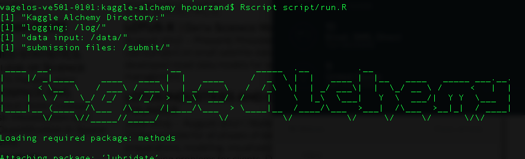

# Kaggle alchemy


The goal of this package is to build a:
- standard file system for Kaggle participation in RStudio, R Notebooks and R.
- versioning and documentation built in code.
- setup AirLiquide, AirBnB and IBX projects.


### Setup

```
git clone https://github.com/lotusxai/kaggle-alchemy.git
cd kaggle-alchemy
```
Download all your data to folder input. Kaggle Alchemy sees csv files inside folder input.

## AirBnB Tasks
```
#wget https://s3.amazonaws.com/h20-lotusx/train_df.csv
#wget  https://s3.amazonaws.com/h20-lotusx/test_df.csv
wget https://phillytalent.s3.amazonaws.com/projects/airbnb/data/TH_data_challenge_d4.csv

```

## AirLiquide Tasks
```
wget s3://phillytalent/projects/airliquide/data/EasySearch.zip
```

## IBX Tasks
```
wget https://phillytalent.s3.amazonaws.com/projects/ibx/data/creditcard.csv
```

# Name your Pipeline
```
Rscript script/run.R
```


version 0.1:
Features:
* builds cache, submit, data folder for [AirBnB tasks](https://phillytalent.com/events/project-airbnb/).
* runs unit tests on data S3 buckets.


### Acknowledgment
[Data Source for CCFraud Demo](https://www.kaggle.com/mlg-ulb/creditcardfraud)
